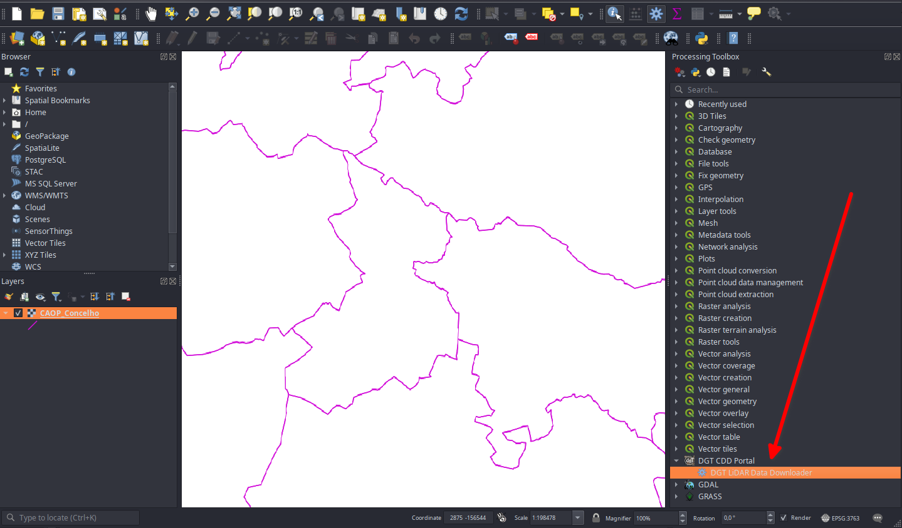
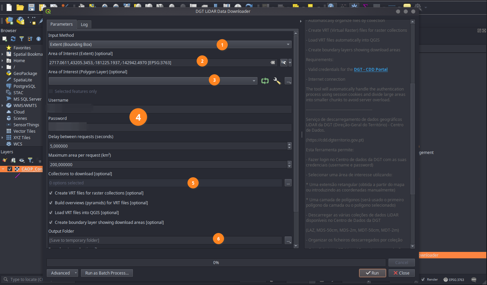
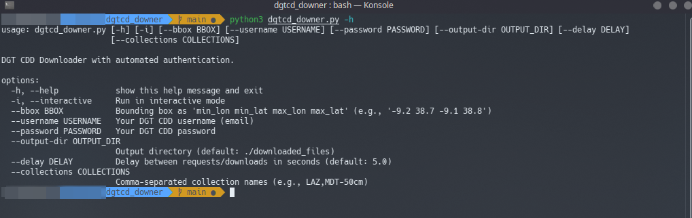

# DGT LiDAR Data Downloader


[Português](#intro) / [English](#overview)


## Intro

Facilita o download de ficheiros do Centro de Dados da DGT, para quem não possa esperar pela API que a DGT ainda irá disponibilizar.

Neste momento, só é possível descarregar ficheiros a partir do site do [CDD](https://cdd.dgterritorio.gov.pt/), desenhando áreas de interesse até 200km², clicando em cada quadrícula para adicionar à lista de downloads, e nesta lista ainda clicar no botão de descarregar todos os ficheiros selecionados.

Para quem precisa de áreas maiores que 200km² o processo é muito moroso, e potencialmente indutor de Síndrome do túnel cárpico [^1], isto enquanto não há uma API para o efeito!

Inicialmente foi criado um script permite a descarga "automática" para áreas maiores, que acabou por evoluir para um plugin [QGIS](https://qgis.org/), com o intuito de facilitar o acesso aos dados de todos os utilizadores.


> [!IMPORTANT]  
> Ferramenta desenvolvida pela comunidade e não afiliada com a Direção-Geral do Território.

### Créditos
À [DGT](https://www.dgterritorio.gov.pt/) o nosso agradecimento pela iniciativa de disponibilizar todos os dados do levantamento LIDAR para o território nacional continental, de forma livre e gratuita. Uma iniciativa com um alcance enorme no exercício de cidadânia no nosso País.

## Instalação / Uso

### Plugin QGIS

* Instala via o gestor de módulos (em breve), ou instala via ZIP, com recurso a este [ficheiro.](https://github.com/qgispt/dgtcd_downer/raw/refs/heads/main/dgt_cdd_downloader.zip)
* O plugin fica disponível para uso na Toolbox do Processing do QGIS.



* o uso do plugin é muito simples, contudo é obrigatório conta no [CDD](https://cdd.dgterritorio.gov.pt/)



1. Podes optar por utilizar a extensão do canvas do QGIS ou por uma extensão definida por um polígono
2. Caso tenhas optado pela extensão, define aqui a área de interesse
3. Caso tenhas escolhido um polígono, define aqui qual polígono a utilizar
4. **Coloca aqui o teu utilizador ou e-mail associado à conta do CDD e respetiva palavra-passe**
5. Escolhe qual ou quais a coleções que pretendes fazer download. **Se nenhuma selecionada irá ser realizado o download de todas**
6. Aconselhamos a definir a pasta de _output_ para os ficheiros não ficarem perdidos na past _temp_ ou _tmp_
7. Não há, mas vai tomar ☕!!


### Linha de comandos

Se quiseres algo mais _raw_ e "simples", podes apenas correr o [script no teu PC](https://raw.githubusercontent.com/qgispt/dgtcd_downer/refs/heads/main/dgtcd_downer.py)

**Requisitos:**
  * O python instalado no sistema
  * conta no [CDD](https://cdd.dgterritorio.gov.pt/)

Verifica os agrumentos necessários para este funcionar com:

```bash
   
   python3 dgtcd_downer.py -h
   
```




**Ou então, corre o script em modo interativo**

1. Na linha de comandos

```bash
   
   python3 dgtcd_downer.py -i
   
```
2. Coloca o teu utilizador ou e-mail associado à conta do CDD

3. Coloca a tua palavra-passe

4. Necessários os valores da bounding box em WGS84, separados por vírgulas, tipo '-8.93493538, 39.40470256, -8.91592816, 39.41428785'
   
   podes usar o plugin [Lat Lon Tools](https://plugins.qgis.org/plugins/latlontools/) do QGIS, para copiar a extensão no canvas. Lembra-te **WGS84**
  
5. Define a pasta para onde queres realizar o download, 
6. Define os segundos de espera entre cada request/download 
7. Seleciona o número da coleção (ex: 1,3 ou Enter para todas na BBox)
8. E vai tomar ☕!!


> [!WARNING]  
> Em muitas redes de entidades / instituições, por questões de segurança, portas estranhas como a 8081 ou a 9000 podem não se encontrar acessíveis e nesses casos o plugin/script podem não funcionar.

## TODO

* Possibilidade de download sem o frontend atual ✅
* Adicionar a feature essencial...barra de progresso ✅
* Autenticação no script ✅
* Possibilidade de download de uma coleção apenas, várias ou todas ✅
* Definir pastas separadas para cada coleção ✅
* Usar params de entrada para permitir scriptar em batch ✅
* Criar vrt de cada coleção descarregada ✅ (no script do QGIS)
* Criar um tile index das coleções descarregadas ❌
* Criar Curvas de Nível como opção do script ❌
* Fazer um micro how-to para utilização ✅ (mais ou menos feito)
* Fazer um UI 💀💀💀... hmmmm nahhh! Ou melhor no QGIS! ✅

> [!WARNING]  
> Com a eventual disponibilização da API, o script poderá ficar obsoleto.


---
---

## Overview

It simplifies the download of files from the DGT Data Center, for those who can't wait for the API that the DGT is yet to make available.

At the moment, you can only download files from the [CDD] website (https://cdd.dgterritorio.gov.pt/) by drawing areas of interest up to 200km², clicking on each square to add it to the download list, and then clicking on the download button for all the selected files.

For those who need areas larger than 200km², the process is very time-consuming, and potentially induces carpal tunnel syndrome [^1], as long as there is no API for the purpose!

Initially, a script was created to allow "automatic" downloading for larger areas, which eventually evolved into a plugin [QGIS](https://qgis.org/), in order to facilitate access to the data for all users.

> [!IMPORTANT] 
> Tool developed by the community and not affiliated with the Direção-Geral do Território.

## Credits
We would like to thank the DGT for the initiative to make all the LIDAR survey data for the national mainland available, free of charge. This initiative has a huge impact on the exercise of citizenship in our country.


## Install / Usage

### Plugin QGIS

* Install via the module manager (coming soon), or install via ZIP, using this [file](https://github.com/qgispt/dgtcd_downer/raw/refs/heads/main/dgt_cdd_downloader.zip)
* The plugin is available for use in the QGIS Processing Toolbox.


* Use of the plugin is very simple, but a [CDD](https://cdd.dgterritorio.gov.pt/) account is required.


1. You can choose to use the QGIS canvas extension or an extension defined by a polygon.
2. If you have chosen the extension, define the area of interest here
3. If you have chosen a polygon, define here which polygon to use
4. **Enter your username or e-mail address associated with your CDD account and password here.**
5. Choose which collection(s) you want to download. **If none are selected, all will be downloaded.
6. We advise you to set the _output_ folder so that the files don't get lost in the _temp_ or _tmp_ folder.
7. There isn't one, but you should go take some ☕!!!


### Command line

If you want something more _raw_ and “simple”, you can just run the [script on your PC](https://raw.githubusercontent.com/qgispt/dgtcd_downer/refs/heads/main/dgtcd_downer.py)

**Requirements**
  * python installed on the system
  * [CDD] account(https://cdd.dgterritorio.gov.pt/)

Check the agruments needed for this to work with:

```bash
   
   python3 dgtcd_downer.py -h
   
```


**Or else, run the script in interactive mode**

1. On the command line

```bash
   
   python3 dgtcd_downer.py -i
   
```
2. Enter your username or e-mail address associated with the CDD account

3. Enter your password

4. You need the bounding box values in WGS84, separated by commas, like ‘-8.93493538, 39.40470256, -8.91592816, 39.41428785’.
   
   you can use the QGIS plugin [Lat Lon Tools](https://plugins.qgis.org/plugins/latlontools/) to copy the extension into the canvas. Remember **WGS84**
  
5. Define the folder you want to download to,
6. Set the number of seconds to wait between each request/download
7. Select the collection number (e.g. 1,3 or Enter for all in BBox)
8. And you should go take some ☕ !!!

> [!WARNING] 
> In many networks of organizations / institutions, for security reasons, strange ports such as 8081 or 9000 may not be accessible and in these cases the plugin/script may not work.

## TODO

* Possibility of downloading without the current frontend ✅
* Add essential feature...progress bar ✅
* Authentication in the script ✅
* Possibility of downloading just one collection, several or all ✅
* Define separate folders for each collection ✅
* Use input params to allow batch scripting ✅
* Create vrt of each downloaded collection ✅ (in QGIS script)
* Create a tile index of the downloaded collections ❌
* Create contour lines as a script option ❌
* Make a micro how-to for use ✅ (more or less done)
* Make a UI 💀💀💀... hmmmm nahhh! Or better in QGIS! ✅


> [!WARNING] 
> With the eventual availability of the API, the script may become obsolete.


[^1]: https://duckduckgo.com/?t=ftsa&q=carpal+tunnel+syndrome&ia=web
